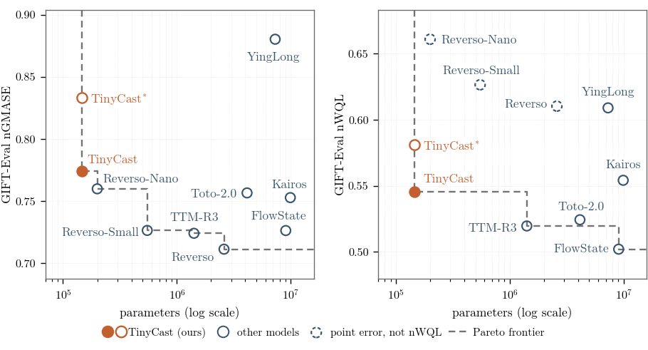

# TinyCast

**An attention-free, 146,505-parameter time-series foundation model.**

TinyCast forecasts unseen series zero-shot and returns nine quantiles rather than a point
estimate. It replaces self-attention with dilated causal convolutions and a zero-parameter
normalized-periodogram phase prior, so periodicity is computed from the context instead of
learned. Every learned operation is a convolution, a matrix multiplication or a normalization,
so the model streams in constant memory and quantizes to INT8.

### Key facts

- **Parameters:** 146,505 (fp32 weights, 0.6 MB)
- **Architecture:** ten dilated causal Conv1d blocks, receptive field 2047 over a context of
  2048, depthwise-separable convolutions, a weight-tied FFN, a phase-gather plus future-conv
  decoder, nine decile quantile outputs
- **Streaming:** left-only convolution padding, so per-step inference is exact in constant memory
- **Weights:** [raws-labs/tinycast](https://huggingface.co/raws-labs/tinycast) on the Hugging Face Hub
- **Paper:** [TinyCast: Probabilistic Zero-Shot Forecasting with Computed Periodicity](https://arxiv.org/abs/2608.15767)
- **License:** Apache-2.0

## Results (GIFT-Eval, zero-shot)



| Metric | Value |
|--------|-------|
| **nGMASE** (point accuracy) | **0.7738** |
| **nWQL** (probabilistic accuracy; the leaderboard's CRPS column) | **0.5454** |
| **nMSIS** (interval score) | **0.5541** |

Geometric means, over the 97 [GIFT-Eval](https://huggingface.co/spaces/Salesforce/GIFT-Eval)
configurations, of the ratio between the model's metric and the seasonal-naive reference's.
Produced with flip-invariance symmetrization, bf16 autocast at compute, and the eval-time
period-alignment downsample rule. The per-configuration results are pinned in the package, so the
aggregates re-derive with no GPU and no benchmark data:

```python
from pathlib import Path

import tinycast
from tinycast import summarize_by_freq_bin

pinned = Path(tinycast.__file__).parent / "reference" / "gift_eval_tinycast.csv"
summarize_by_freq_bin(pinned)["overall"]     # ngmase 0.7738, ncrps 0.5454, nmsis 0.5541
```

The comparator census, the frontier claim and the source of every parameter count are in the paper.

## Installation

```bash
pip install git+https://github.com/raws-labs/tinycast.git
```

One dependency set covers inference, evaluation, training, export and corpus generation. The
GIFT-Eval data loader is the exception, since it has no PyPI release. Note that its distribution
and import names differ:

```bash
pip install "salesforce-gift-eval @ git+https://github.com/SalesforceAIResearch/gift-eval.git"
```

Building the synthetic corpus additionally needs a CUDA device.

## Quick start

```python
from huggingface_hub import hf_hub_download
from tinycast import load_model, TinyCastPredictor

hf_hub_download("raws-labs/tinycast", "config.json")      # lands beside the weights
st = hf_hub_download("raws-labs/tinycast", "model.safetensors")
model, config = load_model(st)                            # TinyCastForPrediction, 146,505 params

predictor = TinyCastPredictor(prediction_length=48, checkpoint_path=st,
                              freq="H", domain="Energy", device="cpu")
forecasts = predictor.predict(test_input)                 # gluonts QuantileForecasts
```

Two things that catch people. Take the parameter count from a model instantiated from its config,
never from a `state_dict()` sum, which reports 321,225 because both FFN stacks are weight-tied and
loading materializes the shared storage under each alias. And the predictor defaults above do not
reproduce the table: flip-invariance symmetrization and period alignment are off, and
`python -m tinycast.eval` is what sets both.

## Reproduce the GIFT-Eval numbers

```bash
export GIFT_EVAL=/path/to/gift-eval
export OMP_NUM_THREADS=4 MKL_NUM_THREADS=4 OPENBLAS_NUM_THREADS=4 NUMEXPR_NUM_THREADS=4

python -m tinycast.eval --ckpt model.safetensors --flip \
    --device cuda --output all_results.csv
```

The thread caps are not optional: without them per-configuration evaluation is roughly 40 times
slower on many-core machines. Leave `TINYCAST_INT8` and `TINYCAST_TILT_K` unset, since both change
what the predictor emits. `tinycast/eval.py` documents the strict-summary behaviour and the
aggregate definitions.

## Train, export, rebuild the corpus

Each entry point carries its own reference documentation; the table points at it.

| task | entry point | where the detail is |
|---|---|---|
| Train | `tinycast.train` | `train()` docstring: the rollout, the committing loss, the schedule, and what a short run does and does not reproduce |
| Export a release | `python -m tinycast.export` | `export.py`: checkpoint averaging, weight-tie preservation, round-trip verification |
| Rebuild the synthetic corpus | `python -m tinycast.corpus build --shard 0` | `corpus.py`: `CANONICAL_RECIPE`, the CUDA requirement and `verify_shard`. The generator families follow Reverso (arXiv 2602.17634, Appendix A); the assumptions are recorded in the `tinycast.synth` docstring |

Distributed training orchestration is not part of this package. `train` is single-process, and the
eight-GPU launcher the released checkpoint was produced with is not included.

## Notebooks

`notebooks/tinycast.ipynb` walks through load, evaluate and summarize. `notebooks/training.ipynb`
covers the objective, the rollout and the release path. Both double as the test suite:

```bash
pip install -e ".[dev]" && pytest --nbmake notebooks/
```

`TINYCAST_NB_SCALE` selects `smoke` or `full`, and `TINYCAST_WEIGHTS` points at a local checkpoint
so the notebooks run offline.

## What is in here

```
tinycast/
  periodogram.py       # zero-parameter normalized-periodogram period detector
  encoding.py          # phase / bounded-recency positional encodings
  backbone.py          # DilatedConvBackbone (dilated-conv encoder + decoder)
  normalization.py     # per-window min-max normalizer
  scale.py             # frequency to seasonal scale factor
  model.py             # TinyCastForPrediction / TinyCastBackbone assembly
  config.py            # TinyCastConfig
  checkpoint.py        # load_model (safetensors + config.json)
  predictor.py         # TinyCastPredictor (AR-rollout gluonts predictor)
  downsample.py        # eval-time period-alignment rule
  quant.py             # INT8 post-training fake-quant (deployment study)
  losses.py            # pinball loss, gated committing term, seasonal copy
  train.py             # the shipped training recipe
  export.py            # checkpoint averaging -> released artifact
  eval.py              # GIFT-Eval driver and the normalized aggregates
  synth.py             # the three synthetic generator families
  corpus.py            # the canonical corpus recipe, builder and verifier
  reference/           # dataset properties, seasonal-naive denominators,
                       # and the pinned per-config results behind the table
gift_eval_submission/  # GIFT-Eval leaderboard submission metadata
notebooks/             # the two walkthroughs, which are also the test suite
```

## Citation

```bibtex
@misc{tinycast2026,
  title         = {TinyCast: Probabilistic Zero-Shot Forecasting with Computed Periodicity},
  author        = {Armin Steinhauser},
  year          = {2026},
  eprint        = {2608.15767},
  archivePrefix = {arXiv},
  primaryClass  = {cs.LG},
  url           = {https://arxiv.org/abs/2608.15767}
}
```

## License and attribution

Apache-2.0 (see `LICENSE`). Third-party attributions are in `NOTICE`.

**Model:** [raws-labs/tinycast](https://huggingface.co/raws-labs/tinycast)
